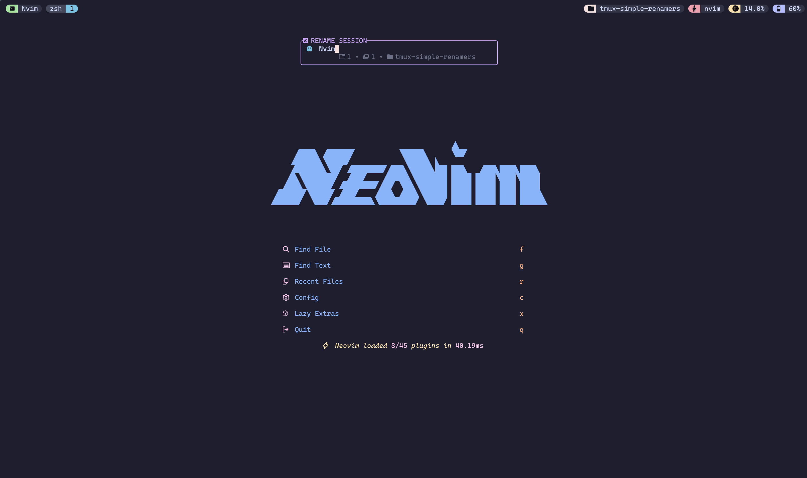
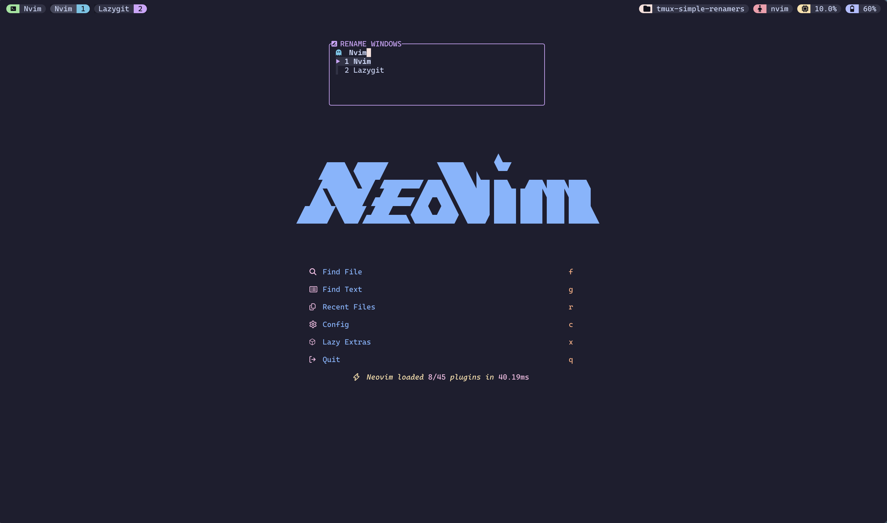
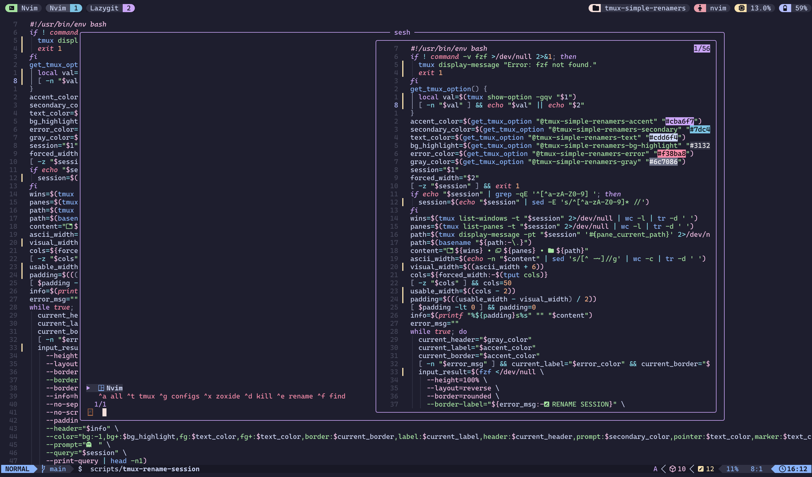

# Simple-renamers - Just some renamers



## Install

### Dependencies

- **[bash](https://www.gnu.org/software/bash/)** - Just simple bash 
- **[tmux](https://github.com/tmux/tmux)** - What were you expecting its a plugin for tmux
- **[TPM](https://github.com/tmux-plugins/tpm)** - To install the plugin 
- **[fzf](https://github.com/junegunn/fzf#fzf-tmux-script)** - To Render the pop ups for the renamers
- **[sesh](https://github.com/joshmedeski/sesh) (optional)** - To use the @tmux-simple-renamers-sesh-integration option
- **[zoxide](https://github.com/ajeetdsouza/zoxide) (optional)** - For sesh integration

### Installation via TPM

Add this line to your `~/.tmux.conf`

```tmux
set -g @plugin 'yahddyyp/tmux-simple-renamers'
```

## Usage 
Press `<prefix> + <C-w>` to open the window renamer and `<prefix> + <C-e>` to open the session renamer.



If you have `set -g @tmux-simple-renamers-sesh-integration` to on press `<prefix> + T` to open the sesh menu and then hover over the session to renamed and then press `<prefix> + <C-e>` to rename that session and then press enter, it will take you back to the sesh menu with the session renamed.

## Configure

### Keybindings
Change the default keys (Default to `<prefix> + <C+e>` and `<prefix> + <C-w>`)

```tmux
set -g @tmux-simple-renamers-session-key '<your-key>'
set -g @tmux-simple-renamers-window-key '<your-key>'
```

### Theme Colors
You can customize all the colors used in the popups.

| Setting | Default | Description |
| :--- | :--- | :--- |
| `@tmux-simple-renamers-accent` | `#cba6f7` | Border and primary icon color |
| `@tmux-simple-renamers-secondary` | `#7dc4e4` | Prompt and metadata color |
| `@tmux-simple-renamers-text` | `#cdd6f4` | Regular text color |
| `@tmux-simple-renamers-bg-highlight` | `#313244` | Selected item background |
| `@tmux-simple-renamers-error` | `#f38ba8` | Border color when a session already exists |
| `@tmux-simple-renamers-gray` | `#6c7086` | Metadata header color |

### Sesh Integration



This plugin can also handle key bindings for `sesh`, the tmux session manager.

By default, this integration is **off**. To enable it, add the following to your `~/.tmux.conf`:

```tmux
set -g @tmux-simple-renamers-sesh-integration 'on'
```

Once enabled, you can customize the key binding for the `sesh-switcher`.

```tmux
set -g @tmux-simple-renamers-sesh-switcher-key '<your-key>'
```

